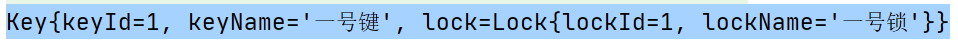
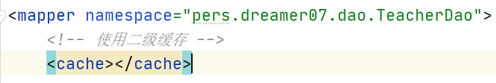

# 第一章 Mybatis 简介

## 1.1 使用工具(不使用)

> 工具：一些功能的简单封装

- 原生 JDBC -> dbUtils(QueryRunner) -> JdvcTemplate(Spring)
- 
- 不使用原生 JDBC：
  1. 操作过程太过繁琐
  2. 会导致 数据库层 在程序中和 java 源代码的耦合程度太高


## 1.2 Hibernate - ORM框架

> ORM：对象关系映射

- 优点：只需要创建好对于的 JavaBean 后使用对应的注解，就可以完成数据库操作

- 大部分是黑箱操作
  
  
  
- 缺点
  - 无法轻松的完成定制 sql
  - 如果想快的完成定制 sql。还需要学习 HQL
  - 全映射框架，对于部分字段映射需要繁琐的操作才可以


## 1.3 MyBatis - 持久化层框架（SQL 映射框架）

- 只需要编写核心的 sql 语句即可
  
  
  
- 优点
  1. MyBatis 可以将重要的步骤( sql 语句) 抽取出来人工定制，其他步骤自动化
  2. 可以将 重要的步骤( sql 语句) 写在配置文件中 - 方便维护
  3. 完全解决数据库优化问题
  4. Mybatis 底层就是对原生 JDBC 的一个简单封装
  5. 可以将 sql 语句和 Java 编码解耦，同时不会失去自动化功能 - 半自动化的持久化层框架
  6. 一个轻量级框架
  
  
  
- **官方中文文档**：https://mybatis.org/mybatis-3/zh/getting-started.html


# 第二章 Mybatis × HelloWorld

## 2.1 核心步骤 

1. 创建工程，数据库数据表，对应的 JavaBean

2. 创建对应的 DAO 接口

3. 导入需要的依赖 / jar 包

   ```xml
   <!-- Mybatis依赖 -->
   <dependency>
       <groupId>org.mybatis</groupId>
       <artifactId>mybatis</artifactId>
       <version>3.4.1</version>
   </dependency>
   
   <!--  mysql数据库链接驱动-->
   <dependency>
       <groupId>mysql</groupId>
       <artifactId>mysql-connector-java</artifactId>
       <version>8.0.16</version>
   </dependency>
   
   <!--  建议导入Log4j2日志框架，可以查看相关日志 -->
   <dependency>
       <groupId>org.apache.logging.log4j</groupId>
       <artifactId>log4j-core</artifactId>
       <version>2.12.1</version>
   </dependency>
   <dependency>
       <groupId>org.apache.logging.log4j</groupId>
       <artifactId>log4j-api</artifactId>
       <version>2.12.1</version>
   </dependency>
   ```

4. 如果导入了 日志框架Log4J2,需要编写一个 log4j2.xml 的配置文件在程序中(任意位置)

   ```xml
   <?xml version="1.0" encoding="UTF-8"?>
   <!--日志级别以及优先级排序: OFF > FATAL > ERROR > WARN > INFO > DEBUG > TRACE > ALL -->
   <!--Configuration后面的status用于设置log4j2自身内部的信息输出，可以不设置，当设置成trace时，可以看到log4j2内部各种详细输出-->
   <configuration status="INFO">
       <!--先定义所有的appender-->
       <appenders>
           <!--输出日志信息到控制台-->
           <console name="Console" target="SYSTEM_OUT">
               <!--控制日志输出的格式-->
               <PatternLayout pattern="%d{yyyy-MM-dd HH:mm:ss.SSS} [%t] %-5level %logger{36} - %msg%n"/>
           </console>
       </appenders>
       <!--然后定义logger，只有定义了logger并引入的appender，appender才会生效-->
       <!--root：用于指定项目的根日志，如果没有单独指定Logger，则会使用root作为默认的日志输出-->
       <loggers>
           <root level="info">
               <appender-ref ref="Console"/>
           </root>
       </loggers>
   </configuration>
   ```

5. 写配置文件

   1. 编写 MyBatis 全局配置文件.xml  - 指导 mybatis 运行的

      ```xml
      <?xml version="1.0" encoding="UTF-8" ?>
      <!DOCTYPE configuration
        PUBLIC "-//mybatis.org//DTD Config 3.0//EN"
        "http://mybatis.org/dtd/mybatis-3-config.dtd">
      <configuration>
        <environments default="development">
          <environment id="development">
            <transactionManager type="JDBC"/>
            <!-- 配置连接池 -->
            <dataSource type="POOLED">
              <!-- 配置连接数据库的四个基本信息 -->
              <property name="driver" value="${driver}"/>
              <property name="url" value="${url}"/>
              <property name="username" value="${username}"/>
              <property name="password" value="${password}"/>
            </dataSource>
          </environment>
        </environments>
        <mappers>
          <mapper resource="org/mybatis/example/BlogMapper.xml"/>
        </mappers>
      </configuration>
      ```

   2. 为一个 Dao 接口配置一个 xml 文件，该配置文件用来作为该接口的实现类 - 描述dao接口中的各个方法是如何工作的

      ```xml
      <?xml version="1.0" encoding="UTF-8" ?>
      <!DOCTYPE mapper
              PUBLIC "-//mybatis.org//DTD Mapper 3.0//EN"
              "http://mybatis.org/dtd/mybatis-3-mapper.dtd">
      <!--
      mapper标签通过 namespaces 属性用来指定需要实现的接口 DAO(全类名)
      -->
      <mapper namespace="pers.dreamer07.dao.EmployeeDao">
          <!--
          select标签代表该对应的实现方法是一个查询方法
              id = 实现的方法名
              resultType = 该方法的返回值类型(全类名)
          -->
          <!--
          在其内部完成 定制 sql 语句
              #{参数名}代表指定位置的数据 由 相同名称的参数名 填充
          -->
          <select id="getEmpById" resultType="pers.dreamer07.bean.Employee">
              select * from employee where id = #{id}
          </select>
      </mapper>
      ```

   3. 我们写的 dao 接口的实现文件，mybatis默认是不知道的，需要在**全局配置文件**添加以下配置

      ```xml
      <!-- 在该标签中指定我们编写的实现文件 -->
      <mappers>
          <!-- resource：从类路径出发 -->
          <mapper resource="mybatis_conf/EmployeeDao.xml"/>
      </mappers>
      ```

   

6. 设计测试类和方法

   ```java
   @Test
   public void testGetEmpById() throws IOException {
       /*
       1. 根据全局配置文件生成一个 SqlSessionFactory 类对象
       	SqlSessionFactory - 负责创建 SqlSession 类对象的一个工厂
       	SqlSession - sql会话，代表一次和数据库的连接
       * */
       String resource = "mybatis_conf/mybatis-config";
       InputStream inputStream = Resources.getResourceAsStream(resource);
       SqlSessionFactory sqlSessionFactory = new SqlSessionFactoryBuilder().build(inputStream);
   
       SqlSession sqlSession = null;
       try {
           /*
           * 2. 根据 SqlSessionFactory 创建 SqlSession sql会话对象
           *       - 相当于 getConnection
           * */
           sqlSession = sqlSessionFactory.openSession();
   
           //3. 使用 sqlSession 操作数据库，获取对应的 Dao 接口实现类
           EmployeeDao employeeDao = sqlSession.getMapper(EmployeeDao.class);
   
           //4. 执行对应的方法
           System.out.println(employeeDao.getEmpById(1));
       } finally {
           if (sqlSession != null) {
               sqlSession.close();
           }
       }
   }
   ```

## 2.2 Mybatis_CRUD

1. 重新设计 EmployeeDao

   ```java
   //定义操作 Employee 表的规范
   public interface EmployeeDao {
   
       //根据id返回Emp对象
       public Employee getEmpById(Integer id);
   
       //添加 Emp 对象,返回 int影响行数
       public int addEmp(Employee employee);
   
       //根据id删除 Emp 对象
       public int deleteEmpById(Integer id);
   
       //修改Emp对象对应的数据库数据，为修改成功返回false(影响行数为0)，修改成功返回true(影响函数大于0)
       public boolean updateEmp(Employee employee);
   }
   ```

2. 在对应的 实现文件 EmployeeDao.xml 中实现对应的方法
   针对于 增删改 的实现方法会有些特殊，详情请看注解

   ```xml
   <?xml version="1.0" encoding="UTF-8" ?>
   <!DOCTYPE mapper
           PUBLIC "-//mybatis.org//DTD Mapper 3.0//EN"
           "http://mybatis.org/dtd/mybatis-3-mapper.dtd">
   <mapper namespace="pers.dreamer07.dao.EmployeeDao">
   
       <!--
       添加 Emp 对象,返回 int影响行数
           - public int addEmp(Employee employee);
           - 对于 增删改 语句不需要写返回类型 returnType 属性，mybatis会自动识别方法的返回值类型
               - 如果返回值类型是 int，就自动返回影响函数
               - 如果返回值类型是 boolean，就返回是否影响了0行以上的数据(0行就返回false，0行以上返回 true)
           - 如果方法接收一个对象类型的形参，在填充占位符时可以直接写上该形参的属性名
       -->
       <insert id="addEmp">
           INSERT INTO employee(empname,email,gender) VALUES(#{empName},#{email},#{gender})
       </insert>
   
       <!--
       根据id删除 Emp 对象
           - public int deleteEmpById(Integer id);
       -->
       <delete id="deleteEmpById">
           DELETE FROM employee WHERE id = #{id}
       </delete>
   
       <!--
       修改Emp对象对应的数据库数据，为修改成功返回false(影响行数为0)，修改成功返回true(影响函数大于0)
           - public boolean updateEmp(Employee employee);
       -->
       <update id="updateEmp">
           UPDATE employee SET empname = #{empName},email = #{email},gender = #{gender} WHERE id = #{id}
       </update>
   
       <!--
       根据id返回Emp对象
            - public Employee getEmpById(Integer id);
       -->
       <select id="getEmpById" resultType="pers.dreamer07.bean.Employee">
           SELECT * FROM employee WHERE id = #{id}
       </select>
   </mapper>
   ```

3. 重新设计测试类和测试方法

   ```java
   public class EmployeeDaoTest {
   
       private SqlSessionFactory sqlSessionFactory = null;
   
       @Before //作为Junit单元测试先行方法执行，初始化 SqlSessionFactory 对象
       public void initSqlSessionFactory() throws IOException {
           /*
           1. 根据全局配置文件生成一个 SqlSessionFactory 类对象
               SqlSessionFactory - 负责创建 SqlSession 类对象的一个工厂
               SqlSession - sql会话，代表一次和数据库的连接
           * */
           String resource = "mybatis_conf/mybatis-config";
           InputStream inputStream = Resources.getResourceAsStream(resource);
           sqlSessionFactory = new SqlSessionFactoryBuilder().build(inputStream);
       }
   
       @Test //测试添加方法
       public void testInsert(){
           SqlSession sqlSession = null;
           try {
           	/*
           	1. 获取 sqlSession 会话对象
               	- 传入一个布尔值，代表是否开始自动提交事务，默认为false，需要手动提交
            	*/
               sqlSession = sqlSessionFactory.openSession(true);
               //2. 获取对应的 Dao 实现类
               EmployeeDao employeeDao = sqlSession.getMapper(EmployeeDao.class);
               //3. 执行方法
               employeeDao.addEmp(new Employee(null,"EMT!!!","EMT@emt.com",1));
           } finally {
               //4. 关闭连接
               if (sqlSession != null) {
                   sqlSession.close();
               }
           }
       }
   
       @Test //测试删除方法
       public void testDelete(){
           SqlSession sqlSession = null;
           try {
           	/*
           	1. 获取 sqlSession 会话对象
               	- 传入一个布尔值，代表是否开始自动提交事务，默认为false，需要手动提交
            	*/
               sqlSession = sqlSessionFactory.openSession(true);
               //2. 获取对应的 Dao 实现类
               EmployeeDao employeeDao = sqlSession.getMapper(EmployeeDao.class);
               //3. 执行方法
               int i = employeeDao.deleteEmpById(2);
               System.out.println("影响行数：" + i);
           } finally {
               //4. 关闭连接
               if (sqlSession != null) {
                   sqlSession.close();
               }
           }
       }
   
       @Test //测试修改方法
       public void testUpdate(){
           SqlSession sqlSession = null;
           try {
           	/*
           	1. 获取 sqlSession 会话对象
               	- 传入一个布尔值，代表是否开始自动提交事务，默认为false，需要手动提交
            	*/
               sqlSession = sqlSessionFactory.openSession(true);
               //2. 获取对应的 Dao 实现类
               EmployeeDao employeeDao = sqlSession.getMapper(EmployeeDao.class);
               //3. 执行方法
               boolean b = employeeDao.updateEmp(new Employee(1, "EMT!", "emt@qq.com", null));
               if (b){
                   System.out.println("修改成功");
               }else{
                   System.out.println("修改失败");
               }
           } finally {
               //4. 关闭连接
               if (sqlSession != null) {
                   sqlSession.close();
               }
           }
       }
   
       @Test
       public void testSelect(){
           SqlSession sqlSession = null;
           try {
           	/*
           	1. 获取 sqlSession 会话对象
               	- 传入一个布尔值，代表是否开始自动提交事务，默认为false，需要手动提交
            	*/
               sqlSession = sqlSessionFactory.openSession(true);
               //2. 获取对应的 Dao 实现类
               EmployeeDao employeeDao = sqlSession.getMapper(EmployeeDao.class);
               //3. 执行方法
               Employee employee = employeeDao.getEmpById(1);
               System.out.println(employee);
           } finally {
               //4. 关闭连接
               if (sqlSession != null) {
                   sqlSession.close();
               }
           }
       }
   
   }
   ```

   

## 2.3 配置文件概述

- 两个配置文件
  1. 全局配置文件：mybatis-config.xml 负责指导 MyBatis 正确运行的一些全局设置
  2. SQL映射文件：EmployeeDao.xml 相当于对指定 Dao 接口的一个实现描述
- 补充细节
  - 通过 SqlSession.getMapper() 获取的对象，是指定接口的代理对象，是由 MyBatis 自动创建的
  - SqlSessionFactroy 和 SqlSession
    - SqlSessionFactroy 负责创建 SqlSession 类对象
    - SqlSession 相当于 Connection，是负责和数据库进行交互的一次会话


# 第三章 全局配置文件

## 3.1 说明

- 入门实例

  ```xml
  <?xml version="1.0" encoding="UTF-8" ?>
  <!DOCTYPE configuration
          PUBLIC "-//mybatis.org//DTD Config 3.0//EN"
          "http://mybatis.org/dtd/mybatis-3-config.dtd">
  <configuration>
      <environments default="development">
          <environment id="development">
              <transactionManager type="JDBC"/>
              <!-- 配置连接池 -->
              <dataSource type="POOLED">
                  <!-- 配置连接数据库的四个基本信息 -->
                  <property name="driver" value="com.mysql.cj.jdbc.Driver"/>
                  <property name="url" value="jdbc:mysql:///mybatis_study?serverTimezone=UTC"/>
                  <property name="username" value="root"/>
                  <property name="password" value="Dreamer07"/>
              </dataSource>
          </environment>
      </environments>
  
      <!-- 在该标签中指定我们编写的实现文件 -->
      <mappers>
          <!-- resource：从类路径出发 -->
          <mapper resource="mybatis_conf/EmployeeDao.xml"/>
      </mappers>
  </configuration>
  ```

  - 可以参看官方文档：https://mybatis.org/mybatis-3/zh/configuration.html


- 配置文件中可以使用的标签 
  - configuration（配置）
    - [properties（属性）](https://mybatis.org/mybatis-3/zh/configuration.html#properties)
    - [**settings（设置）**](https://mybatis.org/mybatis-3/zh/configuration.html#settings)
    - [typeAliases（类型别名）](https://mybatis.org/mybatis-3/zh/configuration.html#typeAliases)
    - [typeHandlers（类型处理器）](https://mybatis.org/mybatis-3/zh/configuration.html#typeHandlers)
    - [objectFactory（对象工厂）](https://mybatis.org/mybatis-3/zh/configuration.html#objectFactory)
    - [plugins（插件）](https://mybatis.org/mybatis-3/zh/configuration.html#plugins)
    - environments（环境配置）
      - environment（环境变量）
        - transactionManager（事务管理器）
        - dataSource（数据源）
    - [databaseIdProvider（数据库厂商标识）](https://mybatis.org/mybatis-3/zh/configuration.html#databaseIdProvider)
    - [mappers（映射器）](https://mybatis.org/mybatis-3/zh/configuration.html#mappers)
  
  
  
- 配置文件中的标签是需要按一定顺序来的
  
  

## 3.2 常用标签

### 3.2.1 properties

- 作用：可以引入外部 properties 文件，且可以通过 {} 获取对应的key的value值

- 代码实例

  ```xml
  <?xml version="1.0" encoding="UTF-8" ?>
  <!DOCTYPE configuration
          PUBLIC "-//mybatis.org//DTD Config 3.0//EN"
          "http://mybatis.org/dtd/mybatis-3-config.dtd">
  <configuration>
  
      <!--
      1. properties 标签的使用
          - 作用：引入外部资源文件
          - 属性
              - resource:从类路径下出发寻找资源
              - url:从磁盘/网络上寻找资源
          - 使用：使用${key}的方式获取对应的value值
      -->
      <properties resource="jdbc.properties"></properties>
  
      <environments default="development">
          <environment id="development">
              <transactionManager type="JDBC"/>
              <!-- 配置连接池 -->
              <dataSource type="POOLED">
                  <!-- 配置连接数据库的四个基本信息 -->
                  <property name="driver" value="${driverClass}"/>
                  <property name="url" value="${url}"/>
                  <property name="username" value="${username}"/>
                  <property name="password" value="${password}"/>
              </dataSource>
          </environment>
      </environments>
  
      <mappers>
          <mapper resource="mybatis_conf/EmployeeDao"></mapper>
      </mappers>
  </configuration>
  ```

  - jdbc.properties

    ```properties
    username=root
    password=Dreamer07
    url=jdbc:mysql:///mybatis_study?serverTimezone=UTC
    driverClass=com.mysql.cj.jdbc.Driver
    ```


### 3.2.2  settings(重要)

- 作用：这是 MyBatis 中极为重要的调整设置，它们会改变 MyBatis 的运行时行为。 下表描述了设置中各项属性设置的含义、默认值等。

  | 设置名                           | 描述                                                         | 有效值                                                       | 默认值                                                |
  | :------------------------------- | :----------------------------------------------------------- | :----------------------------------------------------------- | :---------------------------------------------------- |
  | cacheEnabled                     | 全局性地开启或关闭所有映射器配置文件中已配置的任何缓存。     | true \| false                                                | true                                                  |
  | lazyLoadingEnabled               | 延迟加载的全局开关。当开启时，所有关联对象都会延迟加载。 特定关联关系中可通过设置 `fetchType` 属性来覆盖该项的开关状态。 | true \| false                                                | false                                                 |
  | aggressiveLazyLoading            | 开启时，任一方法的调用都会加载该对象的所有延迟加载属性。 否则，每个延迟加载属性会按需加载（参考 `lazyLoadTriggerMethods`)。 | true \| false                                                | false （在 3.4.1 及之前的版本中默认为 true）          |
  | multipleResultSetsEnabled        | 是否允许单个语句返回多结果集（需要数据库驱动支持）。         | true \| false                                                | true                                                  |
  | useColumnLabel                   | 使用列标签代替列名。实际表现依赖于数据库驱动，具体可参考数据库驱动的相关文档，或通过对比测试来观察。 | true \| false                                                | true                                                  |
  | useGeneratedKeys                 | 允许 JDBC 支持自动生成主键，需要数据库驱动支持。如果设置为 true，将强制使用自动生成主键。尽管一些数据库驱动不支持此特性，但仍可正常工作（如 Derby）。 | true \| false                                                | False                                                 |
  | autoMappingBehavior              | 指定 MyBatis 应如何自动映射列到字段或属性。 NONE 表示关闭自动映射；PARTIAL 只会自动映射没有定义嵌套结果映射的字段。 FULL 会自动映射任何复杂的结果集（无论是否嵌套）。 | NONE, PARTIAL, FULL                                          | PARTIAL                                               |
  | autoMappingUnknownColumnBehavior | 指定发现自动映射目标未知列（或未知属性类型）的行为。`NONE`: 不做任何反应`WARNING`: 输出警告日志（`'org.apache.ibatis.session.AutoMappingUnknownColumnBehavior'` 的日志等级必须设置为 `WARN`）`FAILING`: 映射失败 (抛出 `SqlSessionException`) | NONE, WARNING, FAILING                                       | NONE                                                  |
  | defaultExecutorType              | 配置默认的执行器。SIMPLE 就是普通的执行器；REUSE 执行器会重用预处理语句（PreparedStatement）； BATCH 执行器不仅重用语句还会执行批量更新。 | SIMPLE REUSE BATCH                                           | SIMPLE                                                |
  | defaultStatementTimeout          | 设置超时时间，它决定数据库驱动等待数据库响应的秒数。         | 任意正整数                                                   | 未设置 (null)                                         |
  | defaultFetchSize                 | 为驱动的结果集获取数量（fetchSize）设置一个建议值。此参数只可以在查询设置中被覆盖。 | 任意正整数                                                   | 未设置 (null)                                         |
  | defaultResultSetType             | 指定语句默认的滚动策略。（新增于 3.5.2）                     | FORWARD_ONLY \| SCROLL_SENSITIVE \| SCROLL_INSENSITIVE \| DEFAULT（等同于未设置） | 未设置 (null)                                         |
  | safeRowBoundsEnabled             | 是否允许在嵌套语句中使用分页（RowBounds）。如果允许使用则设置为 false。 | true \| false                                                | False                                                 |
  | safeResultHandlerEnabled         | 是否允许在嵌套语句中使用结果处理器（ResultHandler）。如果允许使用则设置为 false。 | true \| false                                                | True                                                  |
  | mapUnderscoreToCamelCase         | 是否开启驼峰命名自动映射，即从经典数据库列名 A_COLUMN 映射到经典 Java 属性名 aColumn。 | true \| false                                                | False                                                 |
  | localCacheScope                  | MyBatis 利用本地缓存机制（Local Cache）防止循环引用和加速重复的嵌套查询。 默认值为 SESSION，会缓存一个会话中执行的所有查询。 若设置值为 STATEMENT，本地缓存将仅用于执行语句，对相同 SqlSession 的不同查询将不会进行缓存。 | SESSION \| STATEMENT                                         | SESSION                                               |
  | jdbcTypeForNull                  | 当没有为参数指定特定的 JDBC 类型时，空值的默认 JDBC 类型。 某些数据库驱动需要指定列的 JDBC 类型，多数情况直接用一般类型即可，比如 NULL、VARCHAR 或 OTHER。 | JdbcType 常量，常用值：NULL、VARCHAR 或 OTHER。              | OTHER                                                 |
  | lazyLoadTriggerMethods           | 指定对象的哪些方法触发一次延迟加载。                         | 用逗号分隔的方法列表。                                       | equals,clone,hashCode,toString                        |
  | defaultScriptingLanguage         | 指定动态 SQL 生成使用的默认脚本语言。                        | 一个类型别名或全限定类名。                                   | org.apache.ibatis.scripting.xmltags.XMLLanguageDriver |
  | defaultEnumTypeHandler           | 指定 Enum 使用的默认 `TypeHandler` 。（新增于 3.4.5）        | 一个类型别名或全限定类名。                                   | org.apache.ibatis.type.EnumTypeHandler                |
  | callSettersOnNulls               | 指定当结果集中值为 null 的时候是否调用映射对象的 setter（map 对象时为 put）方法，这在依赖于 Map.keySet() 或 null 值进行初始化时比较有用。注意基本类型（int、boolean 等）是不能设置成 null 的。 | true \| false                                                | false                                                 |
  | returnInstanceForEmptyRow        | 当返回行的所有列都是空时，MyBatis默认返回 `null`。 当开启这个设置时，MyBatis会返回一个空实例。 请注意，它也适用于嵌套的结果集（如集合或关联）。（新增于 3.4.2） | true \| false                                                | false                                                 |
  | logPrefix                        | 指定 MyBatis 增加到日志名称的前缀。                          | 任何字符串                                                   | 未设置                                                |
  | logImpl                          | 指定 MyBatis 所用日志的具体实现，未指定时将自动查找。        | SLF4J \| LOG4J \| LOG4J2 \| JDK_LOGGING \| COMMONS_LOGGING \| STDOUT_LOGGING \| NO_LOGGING | 未设置                                                |
  | proxyFactory                     | 指定 Mybatis 创建可延迟加载对象所用到的代理工具。            | CGLIB \| JAVASSIST                                           | JAVASSIST （MyBatis 3.3 以上）                        |
  | vfsImpl                          | 指定 VFS 的实现                                              | 自定义 VFS 的实现的类全限定名，以逗号分隔。                  | 未设置                                                |
  | useActualParamName               | 允许使用方法签名中的名称作为语句参数名称。 为了使用该特性，你的项目必须采用 Java 8 编译，并且加上 `-parameters` 选项。（新增于 3.4.1） | true \| false                                                | true                                                  |
  | configurationFactory             | 指定一个提供 `Configuration` 实例的类。 这个被返回的 Configuration 实例用来加载被反序列化对象的延迟加载属性值。 这个类必须包含一个签名为`static Configuration getConfiguration()` 的方法。（新增于 3.2.3） | 一个类型别名或完全限定类名。                                 | 未设置                                                |
  | shrinkWhitespacesInSql           | Removes extra whitespace characters from the SQL. Note that this also affects literal strings in SQL. (Since 3.5.5) | true \| false                                                | false                                                 |

- 代码实例，这里以设置 mapUnderscoreToCamelCase 修改成 true 为例

  1. 重新设计数据库表，设置一个额外字段 xxx_xx 格式的字段
     
2. 在 xml 中使用对应的标签
  
   ```xml
     <?xml version="1.0" encoding="UTF-8" ?>
     <!DOCTYPE configuration
             PUBLIC "-//mybatis.org//DTD Config 3.0//EN"
             "http://mybatis.org/dtd/mybatis-3-config.dtd">
     <configuration>
     
         <properties resource="jdbc.properties"></properties>
     
         <!--
         2. settings 标签的使用
              - 作用：这是 MyBatis 中极为重要的调整设置，它们会改变 MyBatis 的运行时行为
              - 属性：这里以设置 mapUnderscoreToCamelCase 属性为例
              - 使用：在内部定义 setting 标签，通过其 name 和 value 属性值
                     指定要修改的属性的对应的值
         -->
         <settings>
             <!--
             mapUnderscoreToCamelCase属性：是否开启 驼峰命名自动映射
                 可以将数据库列名 xxx_xxx，自动解析成 xxxXxxx 符合驼峰命名的字段
             -->
             <setting name="mapUnderscoreToCamelCase" value="true"/>
         </settings>
         
         <environments default="development">
             <environment id="development">
                 <transactionManager type="JDBC"/>
                 <!-- 配置连接池 -->
                 <dataSource type="POOLED">
                     <!-- 配置连接数据库的四个基本信息 -->
                     <property name="driver" value="${driverClass}"/>
                     <property name="url" value="${url}"/>
                     <property name="username" value="${username}"/>
                     <property name="password" value="${password}"/>
                 </dataSource>
             </environment>
         </environments>
     
         <mappers>
             <mapper resource="mybatis_conf/EmployeeDao"></mapper>
         </mappers>
     </configuration>
     ```
  
  3. 修改对应的 Bean 类，添加对应的 xxxXxx 属性
  
  4. 执行查询测试方法


### 3.2.3 typeAliases

- 作用：可以为常用的类起别名，使其在 SQL 映射文件中可以不写全类名

- 代码实例

  - 全局配置文件

    ```xml
    <?xml version="1.0" encoding="UTF-8" ?>
    <!DOCTYPE configuration
            PUBLIC "-//mybatis.org//DTD Config 3.0//EN"
            "http://mybatis.org/dtd/mybatis-3-config.dtd">
    <configuration>
    
        <!--
        3. typeAliases
            - 作用：可以为常用的类起别名，使其在 SQL 映射文件中可以不写全类名
            - 使用：在内部定义 typeAlias 标签，通过 type 属性为对应的全类名起别名
        -->
        <typeAliases>
            <!--
            typeAlias 标签
                - 通过设置 type 属性指定对应的全类名，默认别名为类名(不区分大小写)
                - 可以通过设置 alias 属性设置指定的别名(使用时也不区分大小写)
            -->
            <!--        <typeAlias type="pers.dreamer07.bean.Employee" alias="emp"></typeAlias>-->
    
            <!--
            package 标签
                - 通过 name 属性值指定包名，为该包下的所有类起别名,默认别名都是类型(不区分大小写)
            -->
            <package name="pers.dreamer07"/>
        </typeAliases>
    
    </configuration>
    ```

  - SQL 映射文件 - EmployeeDao.xml

    ```xml
    <?xml version="1.0" encoding="UTF-8" ?>
    <!DOCTYPE mapper
            PUBLIC "-//mybatis.org//DTD Mapper 3.0//EN"
            "http://mybatis.org/dtd/mybatis-3-mapper.dtd">
    <mapper namespace="pers.dreamer07.dao.EmployeeDao">
        <!--
        根据id返回Emp对象
             - public Employee getEmpById(Integer id);
             - 如果需要指定别名，需要在对应的类上加上 @Alias 注解指定
        -->
        <!-- resultType可以根据别名找到对应的类，而不用通过全类名 -->
        <select id="getEmpById" resultType="Emp">
            SELECT * FROM employee WHERE id = #{id}
        </select>
    </mapper>
    ```

  - 针对 批量起别名的情况，在对应的 bean 中还可以添加 @Alisa 注解,额外指定别名
    

- 但开发中不建议起别名，因为使用全类名，能帮助我们更容易理解和查看代码

- MyBatis 中已经为一部分类型起了别名，注意自定义别名时不要冲突

  | 别名       | 映射的类型 |
  | :--------- | :--------- |
  | _byte      | byte       |
  | _long      | long       |
  | _short     | short      |
  | _int       | int        |
  | _integer   | int        |
  | _double    | double     |
  | _float     | float      |
  | _boolean   | boolean    |
  | string     | String     |
  | byte       | Byte       |
  | long       | Long       |
  | short      | Short      |
  | int        | Integer    |
  | integer    | Integer    |
  | double     | Double     |
  | float      | Float      |
  | boolean    | Boolean    |
  | date       | Date       |
  | decimal    | BigDecimal |
  | bigdecimal | BigDecimal |
  | object     | Object     |
  | map        | Map        |
  | hashmap    | HashMap    |
  | list       | List       |
  | arraylist  | ArrayList  |
  | collection | Collection |
  | iterator   | Iterator   |


### 3.2.4 typeHandlers 

- 作用：在 Mybatis 处理 预编译语句时设置一个参数 / 从结果集中取出一个值时
  都会使用类型处理器将获取的值以合适的方式转换为 Java 类型


### 3.2.5 plugins 插件

- MyBatis 四大对象
  
  
  
- 作用：可以通过插件修改 MyBatis 的核心行为，**插件通过动态代理机制**
  可以介入四大对象的任何一个方法的执行


### 3.2.6 environments

- 作用：环境管理器，可以在内部通过 environment 标签配置多个环境

- 使用：

  - 可以通过修改 default 属性指定默认的环境id
  - 在内部定义 environment 标签 - 对应一个具体的环境
    - id属性为唯一标识
    - 在内部可以配置 数据源dataSource 和 事务管理器transactionManager

- 代码实例

  ```xml
  <?xml version="1.0" encoding="UTF-8" ?>
  <!DOCTYPE configuration
          PUBLIC "-//mybatis.org//DTD Config 3.0//EN"
          "http://mybatis.org/dtd/mybatis-3-config.dtd">
  <configuration>
  
      <!--
      4，environments标签
          - 作用：环境管理器，可以在内部通过 environment 标签配置多个环境
              - 可以通过修改 default 属性指定默认的环境id
              - environment 标签 - 对应一个具体的环境配置
                  - id属性为唯一标识
                  - 在内部可以配置 数据源dataSource 和 事务管理器transactionManager
      -->
      <environments default="development">
          <environment id="development">
              <transactionManager type="JDBC"/>
              <!-- 配置数据源 -->
              <dataSource type="POOLED">
                  <!-- 配置连接数据库的四个基本信息 -->
                  <property name="driver" value="${driverClass}"/>
                  <property name="url" value="${url}"/>
                  <property name="username" value="${username}"/>
                  <property name="password" value="${password}"/>
              </dataSource>
          </environment>
      </environments>
  
      <mappers>
          <mapper resource="mybatis_conf/EmployeeDao"></mapper>
      </mappers>
  </configuration>
  ```

- 但在开发过程中，我们会更多的使用 **Spring 来配置事务管理器**
  使用 **德鲁伊数据库连接池** 配置数据源


### 3.2.7 databaseIdProvider

- 作用：mybatis 针对数据库移植性使用的标签
- 使用：
  - type属性固定为 DB_VENDOR
  - 在内部使用 property 标签指定数据库厂商和别名

- 代码实例
  (全局配置文件)

  ```xml
  <?xml version="1.0" encoding="UTF-8" ?>
  <!DOCTYPE configuration
          PUBLIC "-//mybatis.org//DTD Config 3.0//EN"
          "http://mybatis.org/dtd/mybatis-3-config.dtd">
  <configuration>
      <environments default="development">
          <environment id="development">
              <transactionManager type="JDBC"/>
              <dataSource type="POOLED">
                  <property name="driver" value="${driverClass}"/>
                  <property name="url" value="${url}"/>
                  <property name="username" value="${username}"/>
                  <property name="password" value="${password}"/>
              </dataSource>
          </environment>
      </environments>
      
      <!--
      5. databaseIdProvider 标签
          作用：mybatis 针对数据库移植性使用的标签
          使用：
              - type属性固定为 DB_VENDOR
              - 在内部使用 property 标签指定数据库厂商和别名
      -->
      <databaseIdProvider type="DB_VENDOR">
          <!--
          property 标签
              使用：
                  - name 属性指定 数据库厂商白标识 [MySQL / Oracle / SQL Server]
                  - value 属性指定对应的别名
          -->
          <property name="MySQL" value="mysql"/>
          <property name="Oracle" value="orac"/>
          <property name="SQL Server" value="sqlserver"/>
      </databaseIdProvider>
  
      <mappers>
          <mapper resource="mybatis_conf/EmployeeDao"></mapper>
      </mappers>
  </configuration>
  ```
  

(SQL 映射文件)

```xml
  <?xml version="1.0" encoding="UTF-8" ?>
  <!DOCTYPE mapper
          PUBLIC "-//mybatis.org//DTD Mapper 3.0//EN"
          "http://mybatis.org/dtd/mybatis-3-mapper.dtd">
  <mapper namespace="pers.dreamer07.dao.EmployeeDao">
  
      <!--
      根据id返回Emp对象
           - public Employee getEmpById(Integer id);
           - 如果需要指定别名，需要在对应的类上加上 @Alias 注解指定
      -->
      <select id="getEmpById" resultType="pers.dreamer07.bean.Employee">
          SELECT * FROM employee WHERE id = #{id}
      </select>
  
      <!--
      databaseId 属性指定配置的 数据库厂商标识的别名
          - 针对于 MyBatis 和不同数据库对接时，优先使用指定了 对应厂商标识 的语句
          - 如果没有对应厂商标识的语句，就使用给默认没有指定 databaseId 属性的语句
      -->
      <select id="getEmpById" resultType="pers.dreamer07.bean.Employee" databaseId="mysql">
          SELECT * FROM employee WHERE id = #{id}
      </select>
  
      <select id="getEmpById" resultType="pers.dreamer07.bean.Employee" databaseId="orac">
          SELECT * FROM employee WHERE id = #{id}
      </select>
  </mapper>
```


### 3.2.8 mappers

- 作用：负责管理 SQL 映射文件在 MyBatis 中的注册

- 使用：在内部定义 mapper / package 标签，通过该标签加载 SQL 映射文件

- 代码实例
  (全局配置文件)

  ```xml
  <?xml version="1.0" encoding="UTF-8" ?>
  <!DOCTYPE configuration
          PUBLIC "-//mybatis.org//DTD Config 3.0//EN"
          "http://mybatis.org/dtd/mybatis-3-config.dtd">
  <configuration>
  
      <properties resource="jdbc.properties"></properties>
  
      <settings>
          <setting name="mapUnderscoreToCamelCase" value="true"/>
      </settings>
  
      <environments default="development">
          <environment id="development">
              <transactionManager type="JDBC"/>
              <!-- 配置数据源 -->
              <dataSource type="POOLED">
                  <!-- 配置连接数据库的四个基本信息 -->
                  <property name="driver" value="${driverClass}"/>
                  <property name="url" value="${url}"/>
                  <property name="username" value="${username}"/>
                  <property name="password" value="${password}"/>
              </dataSource>
          </environment>
      </environments>
  
      <!--
      6. mappers 标签
          - 作用：负责管理 SQL 映射文件在 MyBatis 中的注册
          - 使用：在内部定义 mapper 标签，通过该标签加载 SQL 映射文件
      -->
      <mappers>
          <!--
          mapper标签的使用
              1. resource(常用)：通过类路径加载 SQL 映射文件
              2. url：可以通过 网络 / 磁盘 加载 SQL 映射文件
              3. class：
                  3.1 用法一：指定全类名，要求时在该类的同路径下有一个同名的 SQL 映射文件
                  3.2 用法二：指定全类名：使用注解配置该接口
          -->
  <!--        <mapper resource="mybatis_conf/EmployeeDao.xml"/>-->
          <!--
  		package 标签的使用
  			1. 使用 name 属性值指定包的位置
  			2. 该包下的所有接口必须满足 mapper.class 属性的约束，才可以注册到 MyBatis 中
  				1. 在编译后的同目录下，有同名的 SQL 映射文件
  				2. 使用注解配置该接口
  		-->
          <package name="pers.dreamer07"/>
      </mappers>
  </configuration>
  ```

  (pers.dreamer07)
  

  EmployeeDaoAnno  - 注解配置接口
  

  **针对于Maven工程** ，需要在 pom.xml 中添加以下代码

  ```xml
   <build>
       <!--必须包含资源文件-->
       <resources>
           <resource>
               <directory>src/main/resources</directory>
               <includes>
                   <include>**/*.properties</include>
                   <include>**/*.xml</include>
               </includes>
           </resource>
           <resource>
               <directory>src/main/java</directory>
               <includes>
                   <include>**/*.properties</include>
                   <include>**/*.xml</include>
               </includes>
           </resource>
       </resources>
  </build>
  ```


# 第四章 SQL 映射文件

## 4.1 可以使用的标签

1. chche：与缓存相关
2. chche-ref：与缓存相关
3. parameterMap：**不使用**
4. resultMap:结果映射，自定义结果集的封装规则
5. sql：抽取可以重用的 sql
6. insert，delet，select。update ：增删查改


## 4.2 增删改标签的使用

- 常用属性
  

### 4.2.1 获取插入数据后的自增主键id 

(SQL 映射文件)

```xml
<!--
获取自增id的值 - 使用 insert / update 标签中的 useGeneratedKeys 和  keyProperty 属性
    - useGeneratedKeys：底层调用原生 JDBC 中的方法获取添加数据后自增id的值
    - keyProperty：将获取的自增id的值，赋给 employee 对象中的对应的 属性
-->
<insert id="addEmp" useGeneratedKeys="true" keyProperty="id">
    INSERT INTO employee(emp_name,email,gender) VALUES(#{empName},#{email},#{gender})
</insert>
```

(测试方法)


### 4.2.2 获取非自增主键的值

(SQL 映射文件)

```xml
<!--
获取非自增主键 id 的值
    - 在内部使用 selectKey 标签
-->
<insert id="addEmp2" >
    <!--
    selectKey 标签
       - 作用：可以通过指定 order 属性，设置 BEFPRE / AFTER 可以使其在核心 sql 语句 之前/之后 执行
       - 使用：
            1. 设置 order 属性
            2. 设置 resultType 属性，指定返回值类型
            3. 设置 keyProperty 属性，将查询的返回值赋值给对应的属性
    -->
    <selectKey order="BEFORE" resultType="integer" keyProperty="id">
        SELECT MAX(id) + 1 FROM employee <!-- 对于没有自增id的主键，先查询出最大的主键id值，并将值+1后赋值给对于的属性，后再存入数据 -->
    </selectKey>
    INSERT INTO employee(id,emp_name,email,gender) VALUES(#{id},#{empName},#{email},#{gender})
</insert>
```

(测试方法)


## 4.3 参数的各种取值

1. 单个参数

   - 基本类型
     - 取值：#{随便写}
   - POJO - 看下面

2. 多个参数

   - 注意：无法通过 #{参数名} 获取对于的参数值

   - 取值：

     1. 使用对应的索引，从 0 开始，例如 #{0},#{1}
     2. 使用对应的标识：从 param1 开始，例如 #{param1},#{param2},#{paramN}

   - 原理：
     MyBatis 会将参数封装成一个 Map
     需要使用默认的 key(N / paramN)  来取出对应索引上的数据

   - 解决 - 命名参数

     在方法的定义中，为参数添加 @Param 注解，通过指定 value 值指定对应其在 **MyBatis中的 Key**

     

3. Map

   - 取值：#{key}

4. POJO ( JavaBean )

   - 取值：#{属性名} / #{key.属性名}

## 4.4 取值方式

### 4.4.1 #{}

- 说明：参数预编译；对于的参数位置上都会使用 ? 代替，再通过设置预编译的方式将参数值传递进去；

  ​		    是安全的，不会由 sql 注入问题

- 使用：在需要参数预编译的位置上使用 #{} 取值

### 4.4.2 ${}

- 说明：不是参数预编译，而是直接使用对 sql 语句 进行拼串，不安全的，可能会有 sql 注入问题
- 使用：在不支持参数预编译的位置上使用 ${} 取值


## 4.5 取值时可以使用的规则

- 在我们使用 #{} 取值时可以指定部分规则来约束字段值和属性

  (官方文档)

  

- 最常用的属性时 jdbcType

  > JdbcType :  保存了 Java 类型和 数据类字段类型的映射关系，指定该字段的值在数据库中的字段类型
  - 说明：如果在参数取值时传入 null 值
    - Mysql 在字段允许为空的，不会报错
    - Oracle 会直接报错
  - 针对于以上情况，我们需要在传参是设置 jdbcType 为该字段在 数据库中的字段类型


## 4.6 封装查询结果

### 4.6.1 封装为 List

- 如果需要封装为 List 集合，则除了方法的返回值类型为 List 外，
  在 SQL 映射文件中实现方法时指定 resultType 属性为 集合元素的类型

```xml
<!-- public List<Employee> getEmps();
       - 对于返回值是 List 类型的方法，在实现方法时的 resultType 属性指定为集合元素类型即可
-->
<select id="getEmps" resultType="pers.dreamer07.bean.Employee">
    SELECT * FROM employee
</select>
```

### 4.6.2 封装为 Map

- 查询一条记录封装的 Map

  ```xml
  <!--
  查询一条记录封装的 Map
  public Map<String,Object> getEmpByIdReturnMap(Integer id);
     - key值为查询结果的字段名
     - value值为对应的字段值
  -->
  <select id="getEmpByIdReturnMap" resultType="map"> <!-- MyBatis 为 Map 类型已经定义了别名 map -->
      SELECT * FROM employee WHERE id = #{id}
  </select>
  ```

  - 将一段记录的字段名都作为 key，字段值为对应的 value
  - 在 SQL 映射文件中实现方法时，resultType 属性指定为 map(MyBatis 为 Map 类型默认起的别名）

- 查询多条记录封装的 Map

  ```xml
  <!--
  查询多条记录封装的 Map
  @MapKey("id") //需要通过 @MapKey 注解指定查询结果的字段名作为 返回结果集Map的key值
  public Map<Integer,Employee> getAllEmpReturnMap();
     - key为指定的字段值
     - value 为指定封装的数据类型对象
  -->
  <select id="getAllEmpReturnMap" resultType="pers.dreamer07.bean.Employee"> <!-- 这里和 List 一样，指定为 value 值的数据类型 -->
      SELECT * FROM employee
  </select>
  ```

  - 在接口中定义方法时，需要为方法添加一个 @MapKey 注解
    该注解的 value 值会作为 封装 Map 的 key 时参考的字段
  - 在实现方法时，需要指定 resultType 属性值为 Map.value 的数据类型

### 4.6.3 自定义封装规则

#### MyBatis 默认的封装规则

- 列名和属性名一一对应(不区分大小写)，自动封装
- 列和属性名不一一对应
  1. 开启驼峰命名法(满足驼峰命名规则 - 数据库：xxx_xx；JavaBean：xxxXx)
  2. 起别名

####  resultMap 标签

- 作用：自定义封装规则

- 属性：

  1. id - 唯一标识
  2. type - 为哪一个 JavaBean 进行封装

- 使用：

  1. id 标签 - 将主键列与 JavaBean 中的属性绑定起来
  2. property 标签 - 将普通列与 JavaBean 中的属性绑定起来

  - 通用属性：
    - column：数据库查询后的字段名
    - property：JavaBean 中的属性名

- 代码实例

  ```xml
  <!--
  根据id查询 Cat
  public Cat getCatById(Integer id);
  -->
  <select id="getCatById" resultMap="CatResult"> 
  <!-- resultMap 为 (自定义)封装规则 的id -->
  SELECT * FROM cat WHERE id = #{id}
  </select>
  
  <!--
  resultMap标签
     - 作用：自定义封装规则
     - 属性：
        id - 唯一标识
        type - 为哪一个 JavaBean 进行封装
     - 使用：
        1. id标签：
            - 作用：将主键列与 JavaBean 中的属性绑定起来
        2. result标签：
            - 作用：将普通列与 JavaBean 中的属性绑定起来
            - 属性：
               column：数据库查询后的字段名
               property：JavaBean 中的属性名
  -->
  <resultMap id="CatResult" type="pers.dreamer07.bean.Cat">
      <id column="id" property="id"></id>
      <result column="c_name" property="name"></result>
      <result column="c_age" property="age"></result>
      <result column="c_gender" property="gender"></result>
  </resultMap>
  ```


## 4.7 MyBatis 联合查询

> 在查询一个 JavaBean 时，其属性也是一个 JavaBean
>
> 在数据库中使用外键约束两张对应的表
>
> 在查询一个表中，将另一张表中对应的数据也查询出来封装

### 4.7.1 使用级联属性封装联合查询后的所有结果

1. 在数据库中参加两个表，使用 **外键约束**

2. 编写 sql 语句，先在数据库中进行查询
   

3. 编写 JavaBean 和 Dao 接口

4. 在 SQL 映射文件中，参考查询语句的结果集，**自定义封装规则**

   ```xml
   <!-- 自定义封装规则 -->
   <resultMap id="keyResult" type="pers.dreamer07.bean.Key">
       <id column="key_id" property="keyId"></id>
       <result column="key_name" property="keyName"></result>
       <result column="lock_id" property="lock.lockId"></result>
       <result column="lock_name" property="lock.lockName"></result>
   </resultMap>
   ```

5. 实现对应的方法

   ```xml
   <!--
   根据id查考 Key
   public Key getKeyById(Integer id);
   -->
   <select id="getKeyById" resultMap="keyResult">
       SELECT k.*,l.* FROM `key` k
       LEFT JOIN `lock` l ON l.lock_id = k.lock_id
       WHERE k.key_id = #{id};
   </select>
   ```

6. 设计测试类和测试方法，查看封装结果
   


### 4.7.2 使用 \<association> 标签定义联合查询的对象的封装规则

在 SQL 映射文件中，修改 4.7.1 中的自定义封装规则

```xml
<!-- 自定义封装规则 -->
<resultMap id="keyResult" type="pers.dreamer07.bean.Key">
    <id column="key_id" property="keyId"></id>
    <result column="key_name" property="keyName"></result>
    <!--   <result column="lock_id" property="lock.lockId"></result>-->
    <!--   <result column="lock_name" property="lock.lockName"></result>-->
    <!--
    使用 association标签 修改联合查询对象的封装规则
		作用：表示联合一个对象
		属性：
       	 	- property属性：对应的 级联对象属性
        	- javaType属性：级联对象属性对应的类
    -->
    <association property="lock" javaType="pers.dreamer07.bean.Lock">
        <!-- 自定义Lock属性对应的Lock对象如何封装 -->
        <id column="lock_id" property="lockId"></id>
        <result column="lock_name" property="lockName"></result>
    </association>
</resultMap>
```


### 4.7.3 关联关系

- 1 - 1 ：一对一的关系
  - 举例：一个 key 可以开一把 lock

- 1 - n ： 一对多的关系
  - 举例：一个 lock 可以被多个 key 开
  - 通常外键放在 多 的那一方用来维护 一对多的关系

- n - n ：多对多的关系
  - 举例：一个学生被多个老师指导，一个老师也会指导多名学生
  - 通常使用一个中间表用来维护多对多的关系
    

### 4.7.4 \<collection>

- 作用：定义集合类型属性的封装规则

- 使用 - 建立可以维护一对多关联的属性

  1. 创建两个表 Key 和 Lock，一个 Key 可以开一把 Lock，一把 Lock 可以被多个 Key 开

  2. 在 Lock 表中定义 支持锁的id - lock_id 字段(在 1 - n 的关系中，通常将外键放在 n 的那一方)
     

  3. 设计 Lock 和 Key 的 JavaBean 以及对应的 LockDao

     ```java
     public class Lock {
     
         private Integer lockId;
         private String lockName;
         private List<Key> keyList; //可以开出对应 Lock 的所有 Key 所构成的集合
       
     }
     ```

  4. 编写自定义封装规则

     在内部使用 collection 标签为指定的集合属性编写封装的规则

     ```xml
     <resultMap id="LockResult" type="pers.dreamer07.bean.Lock">
         <id column="lock_id" property="lockId"></id>
         <result column="lock_name" property="lockName"></result>
         <!--
         使用 collection 定义集合元素的封装
             - property：指定集合属性
             - ofType：集合元素类型
         -->
         <collection property="keyList" ofType="pers.dreamer07.bean.Key">
             <id column="key_id" property="keyId"></id>
             <result column="key_name" property="keyName"></result>
         </collection>
     </resultMap>
     ```

  5. 实现方法时，resultMap 指定为自定义的封装规则

     ```xml
     <select id="getLockById" resultMap="LockResult">
         SELECT k.*,l.* FROM `lock` l
         LEFT JOIN `key` k ON l.lock_id = k.lock_id
         WHERE l.lock_id = #{lockId};
     </select>
     ```

     

  7. 测试
     


### 4.7.5 分步查询

> 先将一个表中的数据查找出来，再根据其中的字段值查询出另一个表中的数据

1. 在 KeyDao 和 LockDao 中定义两个额外的方法

   ```java
   //简单实现：根据 id 查询 Key
   public Key getKeyByIdSimple(Integer id);
   
   //简单实现 - 根据 id 查询 Lock
   public Lock getLockByIdSimple(int id);
   ```

2. 在 LockDao.xml 中实现 getLockByIdSimple()

   ```xml
   <!--
   简单实现 - 根据 id 查询 Lock
   public Lock getLockByIdSimple(int id);
   -->
   <select id="getLockByIdSimple" resultType="pers.dreamer07.bean.Lock">
       SELECT * FROM `lock` WHERE lock_id = #{id}
   </select>
   ```

3. 在 KeyDao.xml 中编写自定义封装规则后，实现 getKeyByIdSimple

   ```xml
   <!--
   简单实现：根据 id 查询 Key
   public Key getKeyByIdSimple(Integer id);
   -->
   <select id="getKeyByIdSimple" resultMap="keyResult2">
       SELECT * FROM `key` WHERE key_id = #{id}
   </select>
   <!-- 自定义封装规则 -->
   <resultMap id="keyResult2" type="pers.dreamer07.bean.Key">
       <id column="key_id" property="keyId"></id>
       <result column="key_name" property="keyName"></result>
       <!-- 对 association 标签使用分步查询
       使用 association 根据查询 key 的 lock_id 字段调用其他Dao中的方法，获取对应的 lock 属性
          - property:javaBean属性名
          - select:要调用的方法
          - column:将前一个查找的字段值作为参数传入到 select 对应的方法中，多个参数时使用 ${key1=value1,key2=value2} 的格式
       -->
       <association property="lock" 
                    select="pers.dreamer07.dao.LockDao.getLockByIdSimple" 
                    column="lock_id">
       </association>
   </resultMap>
   ```

   

   - 在 collection 中一样可以完成分步查询


### 4.7.5 按需加载 & 延迟加载

- 说明：

  1. 使用分步查询的使用，如果仅仅需要其中一个数据，却仍需要发送两条 sql 语句，也会导致没有必要的性能浪费

- 使用：在 MyBatis 全局配置文件中，使用 settings 标签开启 **lazyLoadingEnabled 全局延迟加载开关** 和 **aggressiveLazyLoading 延迟加载属性**

  

- 执行测试方法

  

- 在工作中，一般写成两个方法
  1. 简单方法：public Key getKeyByIdSimple(Integer id) - 通常使用延迟加载，需要对应的数据时再发送 sql 语句
  2. 复杂方法：public key getKeyByIdAssicate(Integer id) - 通常使用连接查询，避免简单方法中因为发送过多的 sql 语句导致性能下降


# 第五章 动态 SQL

## 5.1 if标签

- 在实现方法中编写 SQL 语句时使用

- ```xml
  <!--
  根据符合现有条件
  public List<Teacher> getTeacherListByCondition(Teacher teacher);
  -->
  <select id="getTeacherListByCondition" resultMap="TeacherResult">
      SELECT * FROM teacher WHERE
      <!-- 使用 if 标签添加动态 SQL
             - test:OGNL表达式，支持非常多 Java 中的语法，注意特殊字符在 xml 文件中需要使用转义字符
             - id:传入形参对象中的属性名
          -->
      <if test="id!=null"> <!-- 如果test为 true，就会拼接 if 标签中的 SQL 语句-->
          id &lt; #{id} AND <!-- 符合条件时添加的 SQL 语句 -->
      </if>
      <if test="name!=null &amp;&amp; !name.equals(&quot;&quot;)">
          teacher_name LIKE #{name} AND
      </if>
      <if test="birth">
          birth_date > #{birth}
      </if>
  </select>
  
  <!-- 自定义封装规则 -->
  <resultMap id="TeacherResult" type="pers.dreamer07.bean.Teacher">
      <id column="id" property="id"></id>
      <result column="teacher_name" property="name"></result>
      <result column="class_name" property="course"></result>
      <result column="address" property="address"></result>
      <result column="birth_date" property="birth"></result>
  </resultMap>
  ```


## 5.2 WHERE 标签

- 说明：如果只使用 if 标签会可能会导致 SQL 语法错误(由于某些条件不满足，没有拼接上)

- 使用：

  1. 去除原 SQL 语句中的 WHERE 
  2. 用 WHERE 标签包裹 if 标签，第一个 if 标签中的 SQL 语句不使用 AND
  3. 剩下的 if 标签中的 SQL 语句中都在前面加上一个 AND

- 代码实例：

  ```xml
      <!--
      根据符合现有条件
      public List<Teacher> getTeacherListByCondition(Teacher teacher);
      -->
      <select id="getTeacherListByCondition" resultMap="TeacherResult">
          SELECT * FROM teacher
          <!--
          使用 where 标签自动添加 where 和去除不需要的 and
          具体实现就是
              1. 去除原 SQL 语句中的 WHERE
              2. where 中的第一个 if 标签中的 SQL 语句，不使用 AND
              3. 剩下的 if 标签中的 SQL 语句中都在前面加上一个 AND
          -->
          <where>
              <if test="id!=null"> 
                  id &lt; #{id} 
              </if>
              <if test="name!=null &amp;&amp; !name.equals(&quot;&quot;)">
                  AND teacher_name LIKE #{name}
              </if>
              <if test="birth">
                  AND birth_date > #{birth}
              </if>
          </where>
      </select>
  ```

- 代码分析
  

## 5.3 trim 标签

- 说明：可以通过 trim 完成定制化 where 标签
- 使用(属性)
  1. prefix：为以下整体 SQL 语句添加一个指定前缀
  2. prefixOverrides：去除拼接 SQL 语句时出现在前面的多余的指定字符串
  3. suffix：为以下整体 SQL 语句添加一个指定后缀
  4. suffixOverides：去除拼接 SQL 语句时出现在后面的多余的指定字符串、


## 5.4 forEach 标签

- 说明：当 SQL 语句的参数为 集合 / Map 时，需要拿出依次拿出其中的数据与 SQL 语句进行拼接

- 使用(属性)

  - collection:需要遍历的参数 key
  - open="":以指定字符串开始
  -  close="":以指定字符串结束
  - index="":
    - 对于 List 就是为当前元素的索引值起一个别名
    - 当前元素的 key 值起一个别名
  - tem="":为遍历出来的元素起一个别名(Map中的value)
  - separator="":元素间以什么分隔

- 代码实例

  ```xml
  <!--
  根据 id 集合，查询所有对应的教师信息
  public List<Teacher> getTeacherListByIdList(@Param("idList") List<Integer> idList);
  -->
  <select id="getTeacherListByIdList" resultMap="TeacherResult">
      SELECT * FROM teacher WHERE id IN
      <!-- 使用 forEach 标签遍历集合中的元素
                  collection:需要遍历的参数 key
                  open="":以指定字符串开始
                  close="":以指定字符串结束
                  index="":
                      - 对于 List 就是为当前元素的索引值起一个别名
                      - 对于 Map 就是为当前元素的 key 值起一个别名
                  item="":为遍历出来的元素起一个别名(Map中的value)
                  separator="":元素间以什么分隔
          -->
      <foreach collection="idList" open="(" close=")" index="i" item="id" separator=",">
          #{id} <!-- 直接取出元素凭借即可 -->
      </foreach>
  </select>
  ```


## 5.5 choose 分支选择

- 说明：设置条件的优先级，根据条件是否符合规则选择拼接 SQL 语句，类似于 switch -case-default

- 代码实例

  ```xml
  <!--
  根据现有条件，选择其中一个条件查找对应的数据
  public List<Teacher> getTeacherListByConditionChoose(Teacher teacher);
  -->
  <select id="getTeacherListByConditionChoose" resultMap="TeacherResult">
      SELECT * FROM teacher
      <where>
          <!-- 使用 choose 分支选择条件 -->
          <choose>
              <!-- 使用 when 标签进行分支判断，如果进入该分支就拼接对应的 SQL 语句后退出 choose -->
              <when test="id!=null">
                  id = #{id}
              </when>
              <when test="name!=null and !name.equals(&quot;&quot;)">
                  teacher_name = #{name}
              </when>
              <when test="birth!=null">
                  birth_date > #{birth}
              </when>
              <!-- 使用 otherwise 标签，如果上面的 when 都能没执行，就会默认拼接 otherwise 中的 SQL 语句 -->
              <otherwise>
                  1 AND 1
              </otherwise>
          </choose>
      </where>
  </select>
  ```


## 5.6 if + set 动态更新

- 说明：使用 set 标签完成自动添加 SET 子句以及去除多余的 ,
  再使用 if 标签进行条件判断和 SQL 拼接，完成部分字段更新

- 代码实例

  ```xml
  <!--
  动态更新
  public int updateTeacher(Teacher teacher);
  -->
  <update id="updateTeacher">
      UPDATE teacher
      <set>
          <if test="name!=null and !name.equals(&quot;&quot;)">
              teacher_name = #{name},
          </if>
          <if test="course!=null and !course.equals(&quot;&quot;)">
              class_name = #{course},
          </if>
          <if test="address!=null and !address.equals(&quot;&quot;)">
              address = #{address}
          </if>
      </set>
      <where>
          id = #{id}
      </where>
  </update>
  ```

  

## 5.8 OGNL表达式

- 说明：

  对象图导航语言，一种表达式语言，通过它可以方便的来操作对象属性
  类型与 EL 表达式

- 使用

  - 访问对象属性 / 方法：person.name/getName()
  - 调用静态方法/方法：@全类目@静态属性/方法
  - 调用构造方法：new 全类目(参数)
  - 运算符：+,-,*,/,%
  - 逻辑运算符：in,not in,>,>=,<,<=,==,!=

    ！ 在 xml 文件中，有些特殊字符需要使用转义字符

- 使用 - 访问集合伪属性
  
  

#### mybatis 中两个额外的参数

1. _parameter - 代表传入的参数
   - 单个参数的情况下，_parameter就代表这个参数
   - 多个参数的情况下，_parameter就代表多个参数封装的 Map
2. _databaseId - 代表当前的数据库环境
   - 如果配置了 databaseIdProvider，_databaseId就有对应的值
   - 可以在实现方法中结合使用 if 判断**是哪个数据库**
   - 再编写合适的 SQL 语句
   - 而不需要创建多个 增删改 标签实现对不同数据库的支持


## 5.9 sql + include 实现抽取重用 sql 语句

- 说明：对于重复的 sql 语句可以在增删改查标签的同级下定义 \<sql> ，在增删改查标签的内部通过 \<include> 标签引用即可

- 代码实例

  ```xml
  <!--
  使用id作为唯一标识
  -->
  <sql id="baseSelect">
      SELECT * FROM teacher
  </sql>
  <!--
  根据 id 查询对应的数据后封装的 Teacher 对象
  public Teacher getTeacherById(Integer id);
  -->
  <select id="getTeacherById" resultMap="TeacherResult">
      <!--
      使用 include 标签的 refid 属性指定为 <sql> 标签的 id 属性
      将对于的 SQL 语句引入进来
      -->
      <include refid="baseSelect"></include> WHERE id = #{id}
  </select>
  ```


# 第六章 MyBatis 缓存

## 6.1 基本概念说明

- 缓存：暂时的存储一些数据，加快系统的访问速度
- MyBatis 存储机制 - Map：能保存查询出的一些数据
- 分类
  1. 一级缓存：线程级别的缓存；本地缓存；SqlSession级别的缓存
  2. 二级缓存：全局访问的缓存；除过当前线程；多个 SqlSession 都可以使用


## 6.2 一级缓存 - SqlSession 级别的缓存

### 说明	

特点：

1. 默认存在的
   
2. 在 SqlSession close() / flush() 后会清空对应的一级缓存Map

机制：对于查询的数据，MyBatis 默认会就进行缓存(保存在一个 Map 中)，再次查询相同的数据时，直接从缓存中拿


### 一级缓存失效的情况

1. 使用不同的 SqlSession
   - 说明：不同的 SqlSession，使用不同的一级缓存
     - 只有在同一个 SqlSession 期间查询到的数据才会保存在 SqlSession 对应的一级缓存中
   - 代码实例：
     
   
2. 同一个 SqlSession 中使用同一个方法(SQL 语句)，传入不同的参数，会发送新的 sql 语句
   
   
   
   
3. 同一个 SqlSession 执行任意增删改操作时，都会清空一级缓存
   

   

4. 手动清空缓存 
   


### 源码

(PerpetualCache - 获取 / 保存缓存)

- 第一次执行查询语句时
  

- 第二次执行查询语句时
  

- key值的算法：hashCode + 查询的 SqlId + 编写的 sql 语句  + 参数

(BaseExecutor - 执行 Mabtis 底层核心步骤)

- query方法
  


## 6.3 二级缓存 - namespace 级别的缓存

### 说明

- 二级缓存默认是没有配置的，需要手动进行配置

- **二级缓存只有在 SqlSession 关闭 / 提交之后才会将一级缓存中的数据保存在二级缓存中**

- 二级缓存时存在于不同的 namespace 中的，多个 namespace 间的二级缓存不会互相干扰
  
  

### 开启二级缓存

1. 在 MyBatis 配置文件中使用 \<setting> 开启全局缓存开关 - 默认为true，但建议手动设置
   
2. 在需要使用二级缓存的 SQL 映射文件中使用 \<cache> 标签开启二级缓存
   
3. Dao 对应操作的实体类需要实现 Serializable 接口
4. 二级缓存的体会
   


### 缓存的相关属性


### 缓存的查询顺序

1. 优先在 二级缓存 中查找，如果有从二级缓存中获取，并且提高相应的缓存命中率
2. 如果二级缓存中没有，就从对应的一级缓存中查找，如果有返回，降低其在二级缓存中相应的缓存命中率
3. 如果一级缓存中没有，就从数据库中查找，查找后的数据并保存在一级缓存
4. 在 SqlSession 关闭后就会将一级缓存保存到二级缓存

### 缓存原理图


### 缓存有关设置

1. select 标签的 useCache 属性
   - 默认为true，如果为 false 对应的查询结果不会保存在二级缓存，但不会影响到一级缓存
2. 增删改查 标签的 flushCache 属性
   - 增删改 标签默认是 true，当执行时会清空所有一二级缓存
   - 查找 标签默认是 false 
3. sqlSession.clearCache() - 清除对应的一级缓存
4. 当进行了增删改后默认会清除对应 一级 + 二级 中的所有缓存


# 第七章 整合第三方缓存框架

> 整合 ehcache - 一个非常专业的 Java 进程内缓存框架

- MyBatis 缓存原理图
  

### 整合步骤

> 这里面整合的 slf4j  × log4j 
>
> 如果是 log4j2 要自行查找

1. 导入需要 mybatis ×  ehcache 的 依赖 / jar 包

   ```xml
   <!-- 整合依赖 -->
   <dependency>
       <groupId>org.mybatis.caches</groupId>
       <artifactId>mybatis-ehcache</artifactId>
       <version>1.1.0</version>
   </dependency>
   <!-- 核心依赖 -->
   <dependency>
       <groupId>org.ehcache</groupId>
       <artifactId>ehcache</artifactId>
       <version>3.8.1</version>
   </dependency>
   <!-- 日志依赖 -->
   <dependency>
       <groupId>org.slf4j</groupId>
       <artifactId>slf4j-log4j12</artifactId>
       <version>1.7.25</version>
       <scope>test</scope>
   </dependency>
   ```

2. 在类路径的根目录下定义一个 ehcache.xml 配置文件

   ```xml
   <?xml version="1.0" encoding="UTF-8"?>
   <ehcache xmlns:xsi="http://www.w3.org/2001/XMLSchema-instance"
            xsi:noNamespaceSchemaLocation="http://ehcache.org/ehcache.xsd">
    <!-- 磁盘保存路径 -->
    <diskStore path="D:\44\ehcache" />
    
    <defaultCache 
      maxElementsInMemory="1" 
      maxElementsOnDisk="10000000"
      eternal="false" 
      overflowToDisk="true" 
      timeToIdleSeconds="120"
      timeToLiveSeconds="120" 
      diskExpiryThreadIntervalSeconds="120"
      memoryStoreEvictionPolicy="LRU">
    </defaultCache>
   </ehcache>
    
   <!-- 
   属性说明：
   l diskStore：指定数据在磁盘中的存储位置。
   l defaultCache：当借助CacheManager.add("demoCache")创建Cache时，EhCache便会采用<defalutCache/>指定的的管理策略
    
   以下属性是必须的：
   l maxElementsInMemory - 在内存中缓存的element的最大数目 
   l maxElementsOnDisk - 在磁盘上缓存的element的最大数目，若是0表示无穷大
   l eternal - 设定缓存的elements是否永远不过期。如果为true，则缓存的数据始终有效，如果为false那么还要根据timeToIdleSeconds，timeToLiveSeconds判断
   l overflowToDisk - 设定当内存缓存溢出的时候是否将过期的element缓存到磁盘上
    
   以下属性是可选的：
   l timeToIdleSeconds - 当缓存在EhCache中的数据前后两次访问的时间超过timeToIdleSeconds的属性取值时，这些数据便会删除，默认值是0,也就是可闲置时间无穷大
   l timeToLiveSeconds - 缓存element的有效生命期，默认是0.,也就是element存活时间无穷大
    diskSpoolBufferSizeMB 这个参数设置DiskStore(磁盘缓存)的缓存区大小.默认是30MB.每个Cache都应该有自己的一个缓冲区.
   l diskPersistent - 在VM重启的时候是否启用磁盘保存EhCache中的数据，默认是false。
   l diskExpiryThreadIntervalSeconds - 磁盘缓存的清理线程运行间隔，默认是120秒。每个120s，相应的线程会进行一次EhCache中数据的清理工作
   l memoryStoreEvictionPolicy - 当内存缓存达到最大，有新的element加入的时候， 移除缓存中element的策略。默认是LRU（最近最少使用），可选的有LFU（最不常使用）和FIFO（先进先出）
    -->
   ```

3. 在对应的 SQL 映射文件中指定 \<cache> 的 type 属性为对应的缓存实现类

   ```xml
   <!-- 使用 ehcache 第三方缓存框架 -->
   <cache type="org.mybatis.caches.ehcache.EhcacheCache"></cache>
   ```

4. 使用和其他 SQL 映射文件相同的缓存

   ```xml
   <cache-ref namespace="pers.dreamer07.dao.TeacherDao"></cache-ref>
   ```


# 第八章 高级应用

## 8.1 MBG - 逆向工程

> MyBatis Generator

### 8.1.1 说明

1. 正向开发步骤

   table -> javabean -> mapper -> xml -> ... 

2. 逆向工程：根据数据表 table，逆向分析数据表，自动生成 JavaBean -> mapper -> xml -> ..

3. MBG:MyBatis Generator - 代码生成器;  MyBatis 官方支持

### 8.1.2 使用

> 可以参考：https://juejin.im/post/6844903982582743048#heading-4

1. 导入 MyBatis Generator 需要核心依赖 / jar 包

   ```xml
   <!-- 核心依賴 -->
   <dependency>
       <groupId>org.mybatis.generator</groupId>
       <artifactId>mybatis-generator-core</artifactId>
       <version>1.3.5</version>
   </dependency>
   ```

2. 导入 Mybatis Generator 对应的 Maven 插件

   ```xml
   <!-- 引入 MBG 插件 -->
   <plugin>
    <groupId>org.mybatis.generator</groupId>
       <artifactId>mybatis-generator-maven-plugin</artifactId>
       <version>1.3.7</version>
       <configuration>
           <!-- MGB 配置文件 -->
           <configurationFile>src/main/resources/mbg.xml</configurationFile>
           <!-- 允许覆盖生成的文件
                  MyBatis Generator 只会覆盖旧的 pojo、dao、
                  而 *mapper.xml 不会覆盖，而是追加，
                  这样做的目的是防止用户自己写的 sql 语句一不小心都被 MyBatis Generator 				 给覆盖了  -->
           <overwrite>true</overwrite>
           <!-- 导入 pom 中的依赖到生成器的类路径中 -->
           <includeCompileDependencies>true</includeCompileDependencies>
       </configuration>
   </plugin>
   ```
   
3. 编写 `MBG` 配置文件

   ```xml
   <!DOCTYPE generatorConfiguration PUBLIC
           "-//mybatis.org//DTD MyBatis Generator Configuration 1.0//EN"
           "http://mybatis.org/dtd/mybatis-generator-config_1_0.dtd">
   <generatorConfiguration>
       <!-- 引入外部配置文件 -->
       <properties resource="./jdbc.properties"></properties>
   
       <!--
       context:类似于环境
       targetRuntime:生成的模式，可以用 MyBatis3Simple / MyBatis3(生成的比较复杂)
       -->
       <context id="simple" targetRuntime="MyBatis3">
   
           <commentGenerator>
               <!-- 是否不生成注释 -->
               <property name="suppressAllComments" value="true"/>
           </commentGenerator>
   
           <!-- 指定需要连接的数据库 -->
           <jdbcConnection driverClass="${driverClass}"
                           connectionURL="${url}"
                           userId="${username}"
                           password="${password}">
               <!-- 高版本的 mysql 驱动需要添加以下配置 -->
               <property name="nullCatalogMeansCurrent" value="true"/>
           </jdbcConnection>
   
           <!-- 生成 POJO
                   - targetPackage：生成的 POJO 所放的包位置
                   - targetProject:放在哪个工程下
           -->
           <javaModelGenerator targetPackage="pers.dreamer07.bean" targetProject="./src/main/java"/>
   
           <!-- 生成 sql 映射文件
                   - targetPackage：生成的 POJO 所放的包位置
                   - targetProject:放在哪个工程下
           -->
           <sqlMapGenerator targetPackage="pers.dreamer07.dao" targetProject="./src/main/resources"/>
   
           <!-- 生成 DAO 接口
                   - targetPackage：生成的 POJO 所放的包位置
                   - targetProject:放在哪个工程下
           -->
           <javaClientGenerator type="XMLMAPPER" targetPackage="pers.dreamer07.dao" targetProject="./src/main/java"/>
   
           <!-- 指定 数据库表与实体类的映射关系
                   - tableName: 生成实体类的表命
                   - domainObjectName: 对应的实体类名称(默认帕斯卡命名法命名)
           -->
           <table tableName="employee" domainObjectName="Employee" />
           <table tableName="teacher" />
       </context>
   </generatorConfiguration>
   ```

4. 通过启动 Maven 插件，使用 `MBG`

   

5. 测试生成代码

### 8.1.3 细节补充

#### Mapper 接口中的方法

> 如果 MBG 配置文件的 context 标签的 targetRuntime 属性为 MyBatis3Simple 则只会有基础的 CRUD

|                             方法                             |                           功能说明                           |
| :----------------------------------------------------------: | :----------------------------------------------------------: |
| int countByExample(UserExample example) thorws SQLException  |                          按条件计数                          |
|    int deleteByPrimaryKey(Integer id) thorws SQLException    |                          按主键删除                          |
| int deleteByExample(UserExample example) thorws SQLException |                          按条件查询                          |
|    String/Integer insert(User record) thorws SQLException    |                    插入数据（返回值为ID）                    |
|   User selectByPrimaryKey(Integer id) thorws SQLException    |                          按主键查询                          |
| ListselectByExample(UserExample example) thorws SQLException |                          按条件查询                          |
| ListselectByExampleWithBLOGs(UserExample example) thorws SQLException | 按条件查询（包括BLOB字段）。只有当数据表中的字段类型有为二进制的才会产生。 |
|   int updateByPrimaryKey(User record) thorws SQLException    |                          按主键更新                          |
| int updateByPrimaryKeySelective(User record) thorws SQLException |                  按主键更新值不为null的字段                  |
| int updateByExample(User record, UserExample example) thorws SQLException |                          按条件更新                          |
| int updateByExampleSelective(User record, UserExample example) thorws SQLException |                  按条件更新值不为null的字段                  |

#### example 实例解析

> 只有在 MBG 配置文件的 context 标签的 targetRuntime 属性为 MyBatis3 才会有对应的实例

- 主要作用：帮助对应的实体类进行 **复杂查询**

  |                    方法                    |                     说明                      |
  | :----------------------------------------: | :-------------------------------------------: |
  |  example.setOrderByClause(“字段名 ASC”);   |         添加升序排列条件，DESC为降序          |
  |         example.setDistinct(false)         | 去除重复，boolean型，true为选择不重复的记录。 |
  |           criteria.andXxxIsNull            |            添加字段xxx为null的条件            |
  |          criteria.andXxxIsNotNull          |           添加字段xxx不为null的条件           |
  |       criteria.andXxxEqualTo(value)        |           添加xxx字段等于value条件            |
  |      criteria.andXxxNotEqualTo(value)      |          添加xxx字段不等于value条件           |
  |     criteria.andXxxGreaterThan(value)      |           添加xxx字段大于value条件            |
  | criteria.andXxxGreaterThanOrEqualTo(value) |         添加xxx字段大于等于value条件          |
  |       criteria.andXxxLessThan(value)       |           添加xxx字段小于value条件            |
  |  criteria.andXxxLessThanOrEqualTo(value)   |         添加xxx字段小于等于value条件          |
  |        criteria.andXxxIn(List<？>)         |          添加xxx字段值在List<？>条件          |
  |       criteria.andXxxNotIn(List<？>)       |         添加xxx字段值不在List<？>条件         |
  |     criteria.andXxxLike(“%”+value+”%”)     |      添加xxx字段值为value的模糊查询条件       |
  |   criteria.andXxxNotLike(“%”+value+”%”)    |     添加xxx字段值不为value的模糊查询条件      |
  |   criteria.andXxxBetween(value1,value2)    |     添加xxx字段值在value1和value2之间条件     |
  |  criteria.andXxxNotBetween(value1,value2)  |    添加xxx字段值不在value1和value2之间条件    |

#### 使用 example 中的 criteria 完成复杂查询

- example 需要注意的几个属性

  

- 使用

  ```java
  
  /**
   * @program: MybatisCode
   * @description: 测试 TeacherMapper 接口
   * @author: EMTKnight
   * @create: 2020-11-12
   **/
  public class TeacherMapperTest {
  
      private SqlSessionFactory sqlSessionFactory;
  
      @Before
      public void initSqlSessionFactory(){
          InputStream inputStream = null;
          try {
              String resource = "mybatis-config.xml";
              inputStream = Resources.getResourceAsStream(resource);
              sqlSessionFactory = new SqlSessionFactoryBuilder().build(inputStream);
          } catch (IOException e) {
              e.printStackTrace();
          } finally {
              try {
                  if (inputStream != null) {
                      inputStream.close();
                  }
              } catch (IOException e) {
                  e.printStackTrace();
              }
          }
      }
  
      /**
       * 测试复杂查询
       */
      @Test
      public void testSelectByExample(){
          SqlSession sqlSession = sqlSessionFactory.openSession();
          TeacherMapper teacherMapper = sqlSession.getMapper(TeacherMapper.class);
          //1.创建复杂查询对象
          TeacherExample teacherExample = new TeacherExample();
          //-. 设置按指定列名排序,可以在后面加上` desc`表示降序
          teacherExample.setOrderByClause("birth_date");
          //2.创建查询条件对象
          TeacherExample.Criteria criteria = teacherExample.createCriteria();
          /*-. 也可以设置多个 or 查询条件    
          TeacherExample.Criteria criteria2 = teacherExample.createCriteria();
          teacherExample.or(criteria2)
          */
          //3.通过链式调用设置查询条件
          criteria.andClassNameIsNotNull().andTeacherNameIsNotNull();
          List<Teacher> teachers = teacherMapper.selectByExample(teacherExample);
          teachers.forEach(System.out::println);
          sqlSession.close();
      }
  
  }
  ```

- 查看控制台测试结果

  

## 8.2 pageHelper - 分页插件

> 官方文档：https://github.com/pagehelper/Mybatis-PageHelper/blob/master/wikis/zh/HowToUse.md

### 8.2.1 环境搭建

1. 导入对应的 Maven 依赖

   ```java
   <dependency>
       <groupId>com.github.pagehelper</groupId>
       <artifactId>pagehelper</artifactId>
       <version>5.2.0</version>
   </dependency>
   ```

2. 在 Mybatis 全局配置文件中配置对应的 **拦截器**

   ```xml
   <plugins>
       <!-- com.github.pagehelper为PageHelper类所在包名 -->
       <plugin interceptor="com.github.pagehelper.PageInterceptor">
           <!-- 使用下面的方式配置参数，后面会有所有的参数介绍 -->
       	<!--
       	<property name="param1" value="value1"/>
       	-->
   	</plugin>
   </plugins>
   ```

### 8.2.2 分页测试代码

- 设计测试代码

  ```java
  @Test
  public void testSelectPage(){
      SqlSession sqlSession = sqlSessionFactory.openSession();
      TeacherMapper mapper = sqlSession.getMapper(TeacherMapper.class);
      //1. 开始分页,第一个参数为页号，从1开始，第二个参数为每页页数
      PageHelper.startPage(201,5);
      //2. 进行查询(仅生效一次)
      List<Teacher> teacherList = mapper.selectByExample(new TeacherExample());
      //3. 使用 pageInfo 封装查询的数据.第一个参数为数据集合，第二个参数为每页显示的页码数量
      PageInfo pageInfo = new PageInfo(teacherList,5);
      System.out.println("当前页码：" + pageInfo.getPageSize());
      System.out.println("总页码：" + pageInfo.getPages());
      System.out.println("当前数据集合：");
      pageInfo.getList().forEach(System.out::println);
      System.out.println("后一页：" + pageInfo.getNextPage());
      System.out.println("前一页：" + pageInfo.getPrePage());
      System.out.println("当前页需要显示的页码：" + Arrays.toString(pageInfo.getNavigatepageNums()));
      sqlSession.close();
  }
  ```

- 查看控制台打印

  